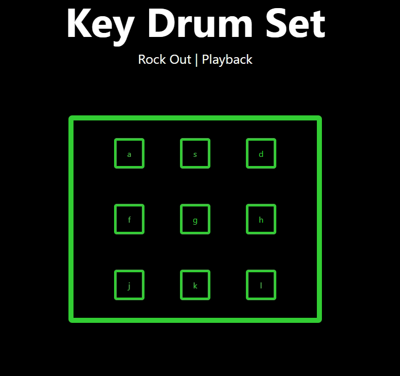

# Keyboard Drumkit
This app provides users with a 9 piece drumkit from the comfort of their keyboard! Using the 9 middle character keys, users
can do anything from tap a hi-hat to thump a bass drum just by pressing keys.

## Music in Motion
The main screen of this app is the keypad itself, which contains the 9 middle character keys. To get started, simply press any key and 
listen for the sound. Each key is mapped to a different drum sound. Sounds can be played at any speed or repetition, allowing for amazing beats.

## How it works
The Applications main feature is key responsive sounds. There is a file with an array of objects that contains the letter, key number and sound for each key. This is passed through to a container that renders out each key. A file with functions was created to create key up and key down events to call the sounds and key transitions. I used hooks to store the state of the key pressed. As long as the key pressed is included inside an array of the 9 letters, it will call the corresponding sound and call the individual key to add an active class.

## What's next
The next feature I want to add to this app is a recording feature, which is indicated by the routing of the "Playback" link. Under the keyboard would be a toggle that would allow users to start and stop recording. When users "start" recording, an array will be created. Every keystroke will create and store two things inside and object, key and duration. These objects would be stored in an array and then be accessible in the Playback tab.
